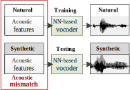
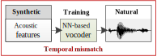
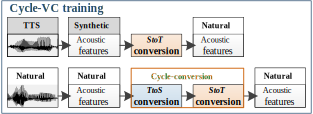
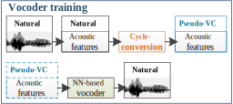
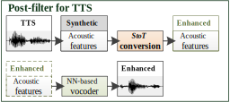
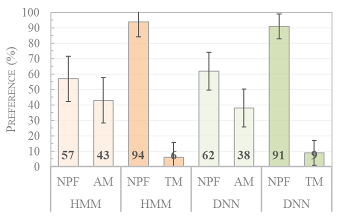
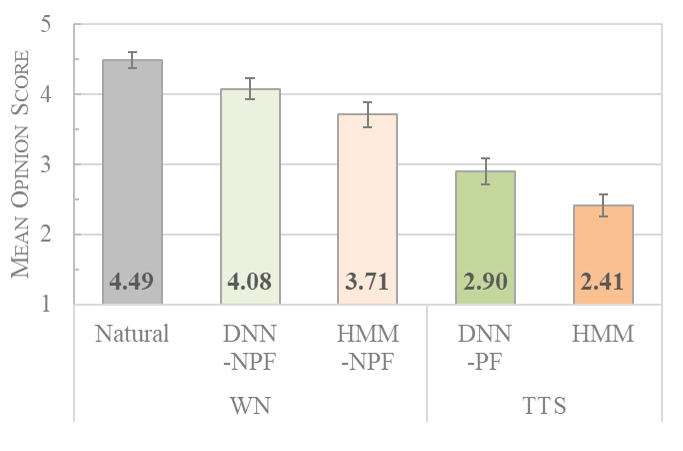
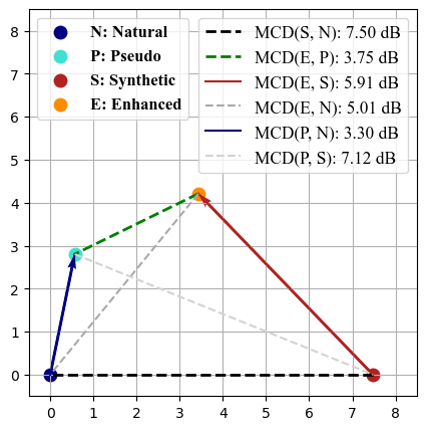
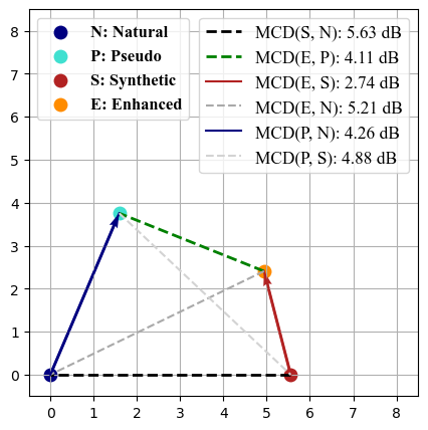

This page is the demo of 
1. "A cyclical post-filtering approach to mismatch refinement of neural vocoder for text-to-speech systems" [[paper](https://arxiv.org/abs/2005.08659)] [[highlight]()] [[YouTube]()]   
  

## **Abstract**  

 Building an advanced TTS system from scratch is time and resource consuming. Therefore, we propose an economical post-filtering approach for existing low-cost TTS systems. However, this approach usually suffers from two issues: 1) temporal mismatches between TTS and natural waveforms and 2) acoustic mismatches between training and testing data. To address these issues, we adopt a cyclic voice conversion (Cycle-VC) model to generate temporally matched pseudo-VC data for training and acoustically matched enhanced data for testing the proposed neural-post-filter (NPF). Because of the generality, this framework can be applied to arbitrary TTS systems. 

## **Acoustic mismatch**  
- Training the NPF with natural features and waveforms
- Testing the NPF with the synthetic features extracted from TTS-speech

  

## **Temporal mismatch**  
- Training the NPF with the synthetic features and natural waveforms

## **Cycle-VC**  
- **Source**: synthetic features
- **Target**: natural features
- **Enhanced** path: synthetic -> natural conversion
- **Pseudo VC** path: natural -> synthetic -> natural conversion

## **NPF training**  
- The **temporal structures** of the pseudo VC features and natural waveforms are matched

## **NPF testing**  
- The **acoustic characteristics** of the pseudo VC and enhanced features are similar

## **Demo Sound**
- Testing with a **DNN-based** low-cost TTS

| Vocoder | Female | Male |
|:--------|:------:|:----:|
| Natural | <audio src="res/audio/lmrkt/Natural/NJ_002.wav" controls preload></audio> | <audio src="res/audio/myssi/Natural/NJ_002.wav" controls preload></audio> |
| DNN | <audio src="res/audio/lmrkt/DNN/wPF/NJ_002.wav" controls preload></audio> | <audio src="res/audio/myssi/DNN/wPF/NJ_002.wav" controls preload></audio> |
| WN (UB *1) | <audio src="res/audio/lmrkt/Natural/WN/NJ_002.wav" controls preload></audio> | <audio src="res/audio/myssi/Natural/WN/NJ_002.wav" controls preload></audio> |
| WN (AM *2) | <audio src="res/audio/lmrkt/DNN/wPF/WN/AM/NJ_002.wav" controls preload></audio> | <audio src="res/audio/myssi/DNN/wPF/WN/AM/NJ_002.wav" controls preload></audio> |
| WN (TM *3) | <audio src="res/audio/lmrkt/DNN/wPF/WN/TM/NJ_002.wav" controls preload></audio> | <audio src="res/audio/myssi/DNN/wPF/WN/TM/NJ_002.wav" controls preload></audio> |
| WN (NPF *4) | <audio src="res/audio/lmrkt/DNN/wPF/WN/NPF/NJ_002.wav" controls preload></audio> | <audio src="res/audio/myssi/DNN/wPF/WN/NPF/NJ_002.wav" controls preload></audio> |

*1. **UB**: upper bound (natural features)   
*2. **AM**: acoustic mismatch   
*3. **TM**: temporal mismatch   
*4. **NPF**: neural-post-filter   
**WN**: WaveNet vocoder

   

- Testing with a **HMM-based** low-cost TTS

| Vocoder | Female | Male |
|:--------|:------:|:----:|
| Natural | <audio src="res/audio/lmrkt/Natural/NI_002.wav" controls preload></audio> | <audio src="res/audio/myssi/Natural/NI_002.wav" controls preload></audio> |
| HMM | <audio src="res/audio/lmrkt/HMM/woPF/NI_002.wav" controls preload></audio> | <audio src="res/audio/myssi/HMM/woPF/NI_002.wav" controls preload></audio> |
| WN (UB *1) | <audio src="res/audio/lmrkt/Natural/WN/NI_002.wav" controls preload></audio> | <audio src="res/audio/myssi/Natural/WN/NI_002.wav" controls preload></audio> |
| WN (AM *2) | <audio src="res/audio/lmrkt/HMM/woPF/WN/AM/NI_002.wav" controls preload></audio> | <audio src="res/audio/myssi/HMM/woPF/WN/AM/NI_002.wav" controls preload></audio> |
| WN (TM *3) | <audio src="res/audio/lmrkt/HMM/woPF/WN/TM/NI_002.wav" controls preload></audio> | <audio src="res/audio/myssi/HMM/woPF/WN/TM/NI_002.wav" controls preload></audio> |
| WN (NPF *4) | <audio src="res/audio/lmrkt/HMM/woPF/WN/NPF/NI_002.wav" controls preload></audio> | <audio src="res/audio/myssi/HMM/woPF/WN/NPF/NI_002.wav" controls preload></audio> |

  

## **Subjective Results** 
- **Mismatch refinement**: preference evaluation of speech quality
- WN w/ NPF outperforms WN w/ AM or TM   

 

- **NPF performance**: MOS evaluation of speech quality   
- WN w/ NPF outperforms original low-cost TTS systems   

  

  

## **Relative distances on MCD-plane** 
- **DNN-based** low-cost TTS  

 

- **HMM-based** low-cost TTS   

  

- MCD of synthetic to natural is high -> natural and synthetic features are very different  

- MCD of enhanced to pseudo VC is much lower -> pseudo VC and enhanced features are similar   

  
[Home](https://bigpon.github.io/)

   
   